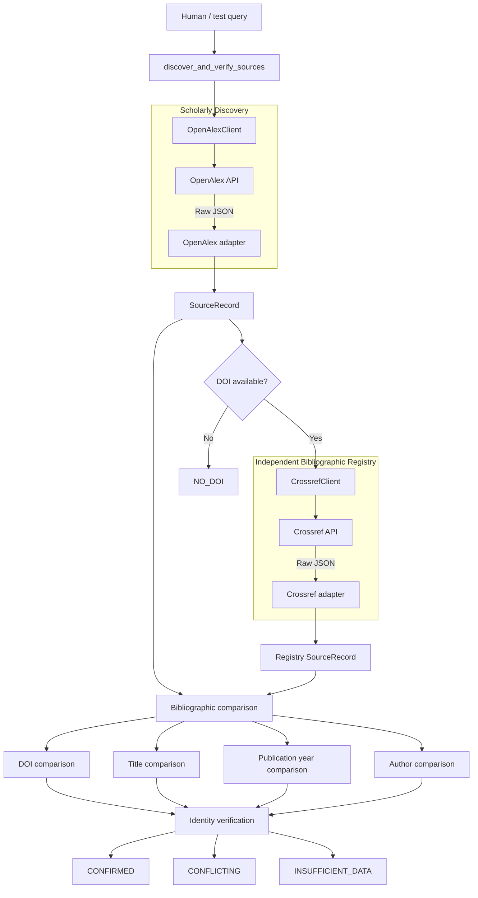
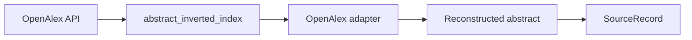
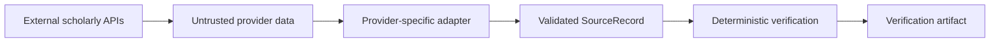
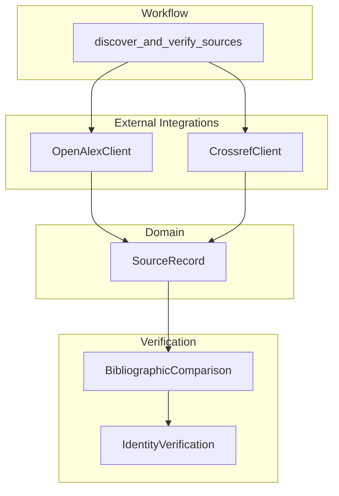
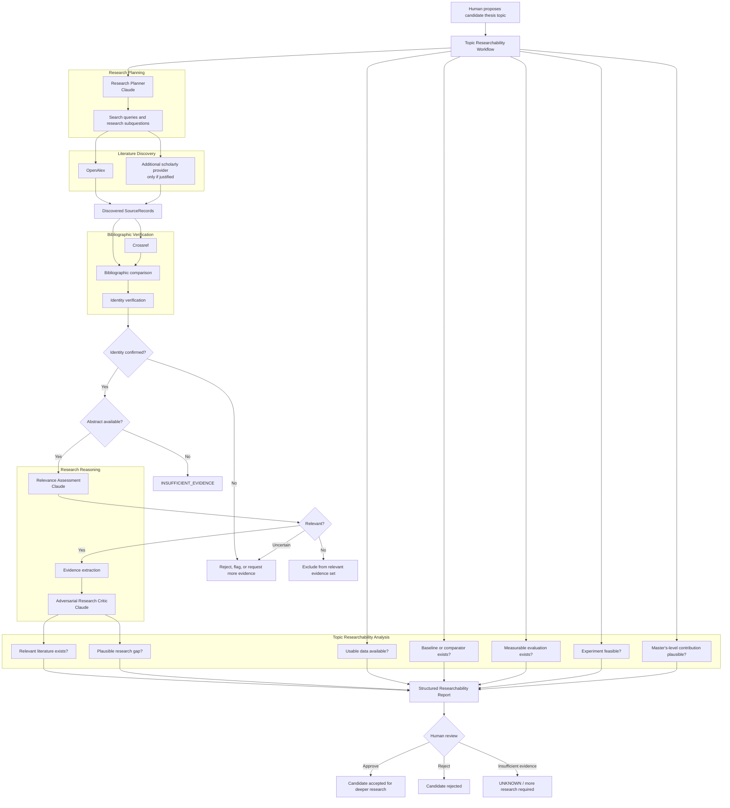
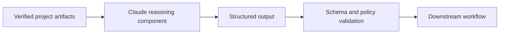
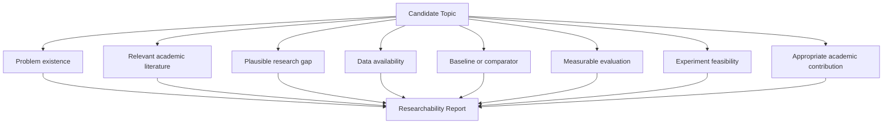
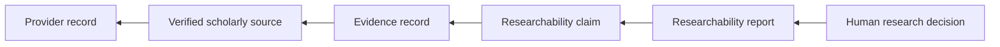
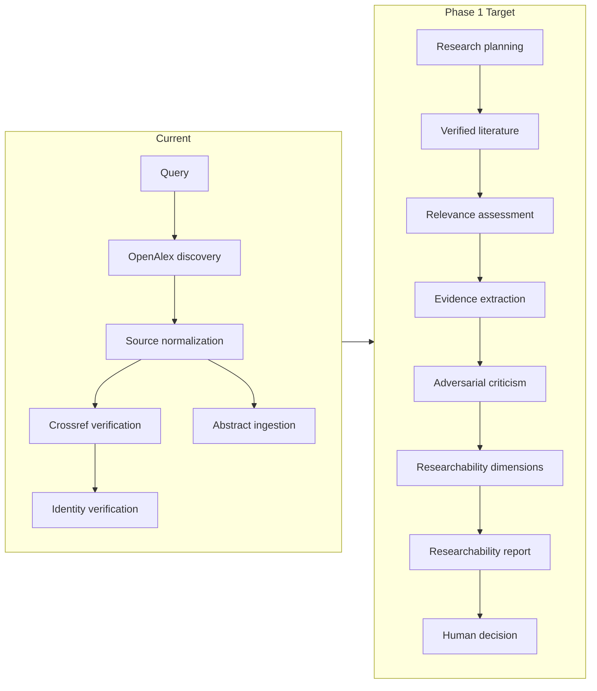

# Topic Researchability Architecture

**Status:** IN PROGRESS
**Phase:** 1 — Topic Researchability

This document distinguishes the architecture that is implemented today from the intended target architecture for Phase 1.

The diagrams describe logical responsibilities and data flow. They do not imply separate deployed services.

---

## 1. Current Implemented State

The current implementation discovers scholarly sources, normalizes provider data, verifies bibliographic identity using an independent registry, and reconstructs abstracts when OpenAlex provides them.



### Abstract ingestion

OpenAlex may expose an abstract as an inverted index rather than ordinary text.

The OpenAlex adapter reconstructs that representation before it enters the rest of the system.



---

## 2. Current Trust Boundary

External provider data is not treated as trusted domain state merely because an API returned it.



The current pipeline therefore preserves the following distinctions:

```text
discovery != verification
verification != relevance
relevance != evidence
evidence != research conclusion
```

Bibliographic identity verification currently requires no LLM.

---

## 3. Current Implemented Components



At this stage:

* OpenAlex performs scholarly discovery.
* Crossref provides an independent DOI registry lookup.
* external metadata is normalized into `SourceRecord`;
* bibliographic fields are compared deterministically;
* identity is classified as `CONFIRMED`, `CONFLICTING`, or `INSUFFICIENT_DATA`;
* discrepancies remain visible rather than being silently discarded;
* abstracts are reconstructed when available;
* no reasoning agent has yet been added to this pipeline.

---

# 4. Phase 1 Target State

Phase 1 is not intended to generate thesis prose.

Its goal is to determine whether a proposed thesis topic is sufficiently researchable to justify deeper research and experimentation.

The desired workflow is:



---

## 5. Intended Reasoning Boundary

Claude should operate on verified or explicitly uncertain artifacts rather than unrestricted model memory.



The intended pattern is:

```text
LLM proposes
    ↓
structured artifact
    ↓
software validates
    ↓
evidence supports
    ↓
human approves when required
```

Claude-generated output is not evidence by itself.

---

## 6. Target Researchability Dimensions

A candidate topic should eventually be evaluated against several independent dimensions.



A single positive signal must not automatically imply that a topic is researchable.

For example:

```text
many papers exist
```

does not by itself establish:

```text
a research gap exists
```

and:

```text
an interesting problem exists
```

does not by itself establish:

```text
usable data or a feasible experiment exists
```

---

## 7. Target Provenance

Every consequential researchability conclusion should eventually be traceable backwards.



Example:

```text
Relevant academic literature exists
        ↓
researchability claim
        ↓
supporting evidence records
        ↓
verified scholarly sources
        ↓
OpenAlex and Crossref identifiers
```

The intended architecture is therefore not:

```text
topic
  ↓
Claude
  ↓
yes / no
```

It is:

```text
topic
  ↓
research planning
  ↓
literature discovery
  ↓
source verification
  ↓
relevance assessment
  ↓
evidence extraction
  ↓
adversarial review
  ↓
researchability analysis
  ↓
structured report
  ↓
human decision
```

---

## 8. Current vs Target



---

## 9. Explicit Non-Decisions

The Phase 1 target architecture does not currently select:

* an orchestration framework;
* LangGraph;
* a database;
* a vector database;
* a persistence implementation;
* MCP;
* a deployment architecture;
* a frontend framework;
* the final number of reasoning agents;
* the exact Claude model for every reasoning role;
* the final evidence persistence schema;
* the final evaluation framework.

These choices should be introduced only when an executable requirement justifies them.

---

## 10. Architecture Evolution Rule

The Phase 1 architecture should evolve according to:

```text
requirement
    ↓
minimal implementation
    ↓
execution
    ↓
observed behaviour
    ↓
failure or missing capability
    ↓
minimal architectural change
```

The target diagram is directional rather than a commitment to implement every box exactly as currently drawn.

The current implementation remains authoritative for what the system actually does today.
